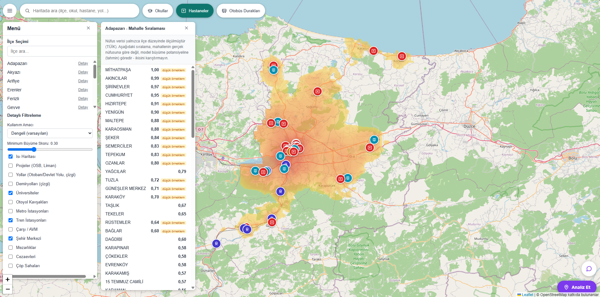
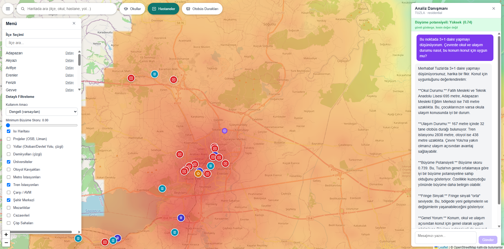

# Urban Growth Mapper

A rule-based urban growth / investment-potential heatmap for Sakarya, Türkiye — built on real government open data, with an optional local-LLM advisory layer that interprets (but never computes) the numbers.

The core scoring engine is **not** a machine-learning model. Every factor's effect on the growth score is a hand-written, literature-verified mathematical curve, and the reasoning is deliberate: an ML model can't explain *why* it produced a given score, while every line of this model traces back to a specific academic finding ("literature X says this, so the curve looks like this"). The trade-off, stated plainly: the weights are informed priors, not calibrated against real Sakarya transaction data (see [Methodology](#methodology--literature) for exactly which claims are and aren't backed this way).

An LLM sits *on top* of this engine as a strictly optional, swappable layer — it turns a point's already-computed numbers into Turkish prose for a user's specific question, and is contractually forbidden (via its system prompt and the shape of the data it's given) from inventing a distance, a score, or a price estimate.

## Screenshots

**Heatmap, category layers, and mahalle-level growth ranking**


**Point-and-ask LLM advisory chat**


## Key Features

- **Multiplicative, 15-factor growth heatmap** over a real province boundary (not a bounding box), with a per-cell score derived from proximity/exposure to infrastructure, transit, hazards, land use, and population trends.
- **Three land-use profiles** (Residential / Commercial / Industrial) — the same 15 factors, reweighted per profile, because a highway junction is a strength for a logistics site and a weakness for housing.
- **Mahalle-level (neighbourhood) drill-down**: click a district for its neighbourhoods ranked by growth potential, with low-sample-size flagged explicitly and population kept visually separate from the model's prediction — a measured fact is never blended with a forecast.
- **Point-and-ask LLM advisory chat** (local Ollama by default): drop a pin, state an intent ("I'm considering housing here"), and get a plain-language read of the real, backend-computed context for that exact point — never a fabricated number, never a price promise.
- **Real infrastructure, not placeholders**: roads/railways rendered as actual line geometry, 2,600+ live-tracked bus stops, hospitals, schools (geocoded once, cached), universities, hazard/LULU sites (prisons, landfills, cemeteries) — see [Data Sources](#data-sources).
- **Google Maps-style UI**: a single search bar over districts/schools/hospitals/roads, quick-toggle category chips, a growth-score threshold filter, and per-category map markers.

## Tech Stack

| Layer | Technologies |
|---|---|
| Backend API | Python 3.11, FastAPI, Pydantic v2, Uvicorn |
| Geodata / ORM | SQLAlchemy 2.0, GeoAlchemy2, Shapely, PyProj |
| Database | PostgreSQL 16 + PostGIS 3.4 |
| Offline analysis | GeoPandas, Rasterio, NumPy, SciPy, Matplotlib (MAUP/resolution-sensitivity study, not part of the served API) |
| Advisory LLM | Ollama (local, model-agnostic — `gemma3:12b` by default), plain HTTP `/api/chat` |
| Frontend | React 18, Vite, Leaflet + `leaflet.markercluster` |
| Testing | Pytest (116 tests: domain scoring logic + application-service integration) |
| Infra | Docker Compose (Postgres/PostGIS, backend, frontend) |

No Redux/state library, no CSS framework, no map-vendor lock-in beyond Leaflet + OpenStreetMap tiles — kept deliberately small for a project whose complexity lives in the scoring domain, not the UI plumbing.

## Architecture

Backend follows a strict layered/SOLID structure so the scoring domain has zero framework or database dependencies:

```text
API            FastAPI routers, Pydantic request/response models
  |
Application    Use-case orchestration (HeatmapService, AdvisoryService, ...)
  |
Domain         Pure Python: entities, IScoreContributor implementations,
  |            band functions, geo math - no SQLAlchemy, no FastAPI, no I/O
  |
Infrastructure PostGIS repositories, Overpass/CKAN/Ollama HTTP clients
```

New scoring factor -> implement `IScoreContributor`, append it to the composite scorer in `core/di.py`. Existing contributors never change for that. Same Open/Closed principle extends to swapping the LLM provider: change one line in the composition root, `HeatmapService` and everything above it is untouched.

```text
CompositeHeatmapScorer (multiplicative: score = product of all contributor multipliers)
 ├─ ProjectProximityContributor       — highway/rail/OSB/port line-segment proximity
 ├─ PoiProximityContributor           — category-weighted POI proximity
 ├─ CityCenterAccessContributor       — Alonso bid-rent (dominant factor)
 ├─ RailStationAccessContributor      — inverted-U (noise near, access peak, decay)
 ├─ HighwayJunctionAccessContributor  — inverted-U ("interchange effect")
 ├─ IndustrialZoneAccessContributor   — inverted-U (commutershed band)
 ├─ UniversityProximityContributor    — monotonic accessibility
 ├─ HighwayNoiseContributor / RailwayNoiseContributor — line-proximity penalty
 ├─ HazardPenaltyContributor          — hazard-zone proximity penalty
 ├─ NegativeExternalityContributor    — LULU proximity penalty (prison/landfill/cemetery)
 ├─ PopulationGrowthContributor / PopulationMomentumContributor — CAGR + momentum
 ├─ GrowthDirectionContributor        — 8-sector growth relative to city average
 └─ FringeContributor                 — urban-rural fringe / leapfrog-growth signal
```

Frontend is a flat component set (no framework beyond React itself): `TopSearchBar`, `FilterDrawer`, `MapView`, `AdvisoryChatPanel`, `DistrictDetailPanel`, plus a self-contained monochrome SVG icon set (no icon-font/CDN dependency).

## Methodology & Literature

The model is grounded in specific, checkable sources rather than folk intuition:

| Factor | Theoretical basis |
|---|---|
| City-center (CBD) access, dominant weight | Alonso, *Location and Land Use* (1964) — bid-rent theory |
| Land-use profiles (Residential/Commercial/Industrial) | Von Thünen, *Der isolierte Staat* (1826) — differing rent curves per land use |
| Multiplicative (not additive) combination | Rosen, *Hedonic Prices and Implicit Markets* (1974, JPE) — hedonic effects compound as percentages, not flat sums |
| Rail-station / highway-junction / OSB inverted-U curves | Empirical hedonic literature (train-station proximity: ~20–40% value spread) + "interchange effect" (commercial/logistics value peaks 1–5km out, not at the junction itself) |
| LULU proximity penalty (prisons, landfills, cemeteries) | Locally-unwanted-land-use / environmental-justice hedonic literature |
| Urban-fringe & leapfrog-growth signal | Tobler, *First Law of Geography* (1970) |
| Population growth momentum | Momentum concept adapted from finance/economics (rate-of-change-of-rate, not just level) |
| Grid resolution choice (1km) | Openshaw, *The Modifiable Areal Unit Problem* (1984) — validated with a dedicated offline resolution-sensitivity study (`backend/analysis/`) rather than assumed safe |
| School-quality limitation (acknowledged, not solved) | Black, *Do Better Schools Matter?* (1999, QJE) — parents price school *quality*, not distance; no quality dataset (e.g. exam results) was available, so this factor is honestly distance-only |

**Consciously not implemented**, and why: earthquake/liquefaction risk (Turkey's official active-fault map, MTA's *Diri Fay Haritası*, is copyright-restricted — no commercial/redistribution rights are granted; a CC-BY-SA-licensed alternative, the GEM Global Active Faults Database, was identified and confirmed to cover the Sakarya area, but isn't integrated yet), land price anchoring (no accessible price dataset), and early signals from *planned*-but-unbuilt infrastructure (partially present in OSM tags, not yet queried).

## Data Sources

All real, none synthetic:

| Data | Source |
|---|---|
| Population (16 districts, 2020–2024) & neighbourhood boundaries (677 mahalle polygons) | Sakarya Büyükşehir Belediyesi open-data portal (CKAN) |
| Province boundary | OpenStreetMap / Nominatim (relation 223462) |
| Highways, railways, OSB (industrial zones), ports, stations, junctions, universities, prisons, landfills, cemeteries, building density | OpenStreetMap via the Overpass API |
| Bus stops (2,600+) | Sakarya Büyükşehir Belediyesi's live transit-tracking API |
| Hospitals | Municipal open-data KMZ export |
| Schools | Municipal address list, geocoded once via the Google Geocoding API and cached permanently (not a live per-request dependency) |

## API Endpoints

| Endpoint | Description |
|---|---|
| `GET /api/v1/heatmap` | Scored grid for a city + land-use profile |
| `GET /api/v1/regions` / `POST /api/v1/regions/generate` | Heatmap grid cells |
| `GET /api/v1/projects` / `POST /api/v1/projects` | Infrastructure projects (highway/rail/OSB/port) |
| `GET /api/v1/points-of-interest` | POIs, filterable by repeated `?category=` |
| `GET /api/v1/road-geometries` | Real line geometry for named highways/railways |
| `GET /api/v1/districts` | District-level population + growth rate |
| `GET /api/v1/districts/{name}/boundary` | District boundary as GeoJSON |
| `GET /api/v1/districts/{name}/mahalle-scores` | Neighbourhood-level growth-score ranking within a district |
| `GET /api/v1/hazard-zones` / `POST /api/v1/hazard-zones` | Hazard zones |
| `POST /api/v1/advisory` | First turn of the point-advisory chat |
| `POST /api/v1/advisory/chat` | Follow-up turns (stateless — client resends context) |
| `GET /health` | Liveness check |

Interactive Swagger docs at `/docs` once the backend is running.

## Installation

### Option A — Docker (fastest path)

Requires Docker Desktop.

```bash
git clone https://github.com/SMutaf/urban-growth-mapper.git
cd urban-growth-mapper
docker compose up --build
```

This starts PostGIS, the backend (`http://localhost:8000`), and the frontend (`http://localhost:5173`). The database schema is created automatically on first boot.

Optional environment variables (copy `.env.example` to `.env` next to `docker-compose.yml`):

| Variable | Purpose |
|---|---|
| `GOOGLE_GEOCODING_API_KEY` | Only needed for the schools/audit ingestion scripts |
| `ADVISORY_LLM_ENABLED` | Set `false` to disable the advisory chat entirely (rest of the app is unaffected) |

The advisory chat expects an [Ollama](https://ollama.ai) instance reachable from the container (`http://host.docker.internal:11434` by default) — run Ollama on the host with `ollama pull gemma3:12b`, or point `OLLAMA_BASE_URL` at a remote instance.

Real Sakarya data isn't baked into the image (the ingestion scripts hit live external APIs and shouldn't run unattended on every restart) — run them once after the containers are up:

```bash
docker compose exec backend python scripts/ingest_sakarya_population.py
docker compose exec backend python scripts/ingest_sakarya_osm.py
docker compose exec backend python scripts/ingest_sakarya_bus_stops.py
docker compose exec backend python scripts/ingest_sakarya_hospitals.py
docker compose exec backend python scripts/ingest_sakarya_road_geometries.py
docker compose exec backend python scripts/regenerate_regions.py sakarya 1.0
# Optional, needs GOOGLE_GEOCODING_API_KEY:
docker compose exec backend python scripts/ingest_sakarya_schools.py
```

### Option B — Native

Requires Python 3.11+, Node 18+, and PostgreSQL/PostGIS.

```bash
git clone https://github.com/SMutaf/urban-growth-mapper.git
cd urban-growth-mapper

# Database (or point DATABASE_URL at your own PostGIS instance)
docker compose up -d db

# Backend
cd backend
python -m venv .venv && source .venv/bin/activate  # Windows: .venv\Scripts\activate
pip install -r requirements.txt
cp .env.example .env
python scripts/init_db.py
python scripts/ingest_sakarya_population.py   # repeat for the other ingest_*.py scripts, see above
uvicorn app.main:app --reload

# Frontend (new terminal)
cd frontend
npm install
npm run dev
```

## Testing

```bash
cd backend
pytest -q
```

116 tests cover the domain scoring contributors in isolation and the application-service layer end-to-end (including a mock-LLM suite that asserts the advisory chat never fabricates a number — every distance/score it's asked to interpret is checked against what the backend actually computed).

## Future Improvements

- Real-transaction calibration of contributor weights (currently literature-informed priors, not fitted)
- Earthquake/liquefaction hazard factor, once a properly-licensed Sakarya-specific dataset is integrated
- Planned (not-yet-built) infrastructure as an early growth signal
- CI pipeline and cloud deployment

## License

MIT — see [LICENSE](LICENSE).
